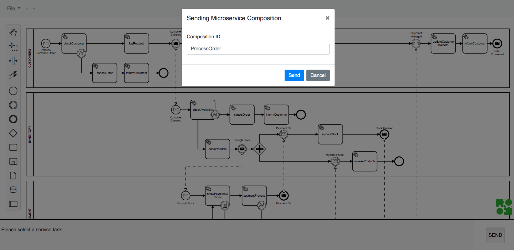

# Microservice composition based on the Choreography of BPMN fragments. Example

This example shows how to create a choreographed composition of microservices by using BPMN diagrams. 
To do so, the supporting infrastructure available in the following Github repository is used: [microservices-composition-infrastructure](https://github.com/microserviceresearch/microservices-composition-infrastructure).

# About
This work presents a microservice composition approach based on the choreography of BPMN fragments. On the one hand, developers can describe the big picture of the composition with a BPMN model, providing a valuable mechanism to analyse it when engineering decisions need to be taken. On the other hand, this model is split into fragments in order to be executed though an event-based choreography form, providing the high degree of decoupling among microservices demanded in this type of architecture. 

This composition approach is supported by a microservice infrastucture developed to achieve that both descriptions of a composition (big picture and split one) coexist. In this sense, microservices compositions can be evolved graphically from both either the BPMN descrition of the big picture or a BPMN fragment.

# Example overview

This example is composed by 8 microservices:

* 4 business microservices: Customers, Inventory, Payment and Shipment. These microservices are endowed with the functionality provided by the Composition Controller module, which supports the choreographed execution of BPMN fragments.
* 2 typical infrastucture microservices: an Eureka service registry, and a Zuul gateway
* 2 additional microservices for supporing the composition of business microservices: the Fragment Manager and the Global Composition Manager

# Building and executing the example

Clone this Github repository and build each microservice with Gradle. To execute the microservice composition this example assumes you have [RabbitMQ](https://www.rabbitmq.com/) installed and started.

Execute the microservices in the following order:
<ol>
<li>Eureka Server</li>
<li>Zuul Gateway</li>
<li>Global Composition Manager</li>
<li>Fragment Manager</li>
<li>Business microservices</li>
</ol>

# Creating a microservice composition

The Global Composition Manager publishes at http://localhost:8084 a BPMN editor to create microservice composition. An animated snapshot of the BPMN editor is show next.

This editor allows you to associate a microserive to a BPMN pool and the operations of this microservice to the service tasks of this pool. The operations are obtained from Eureka, which is accessed through Zuul in order to avoid Cross Domain Origin problems.

To test the example you can create a microservice composition from scratch or use the example uploaded at the root of this reposittory. 

Once the microservice composition is created you just need to click the SEND button and give and ID to the compsition. Then, the composition is sent to the Fragment Manager which splits it into fragments and distributes them among the business microservices.

# Executing a microservice composition

The communication among microservices is done in an event-based way through a RabbitMQ server. Thus, this example assumes you have [RabbitMQ](https://www.rabbitmq.com/) installed.

To execute the composition you just need to publish a message to a Topic exchange in RabbitMQ using the following routing key: 

[miroservice].[compositionID]

where [microservice] is the ID of the microservice that must start the composition and [compositionID] the id you have given to the composition.

The message to publish is a JSON description with the message property. The value of this property must fit the following structure:

[compositionID]_[BPMNMessageName]Message

where [compositionID] is the id you have given to the composition and [BPMNMessageName] is the name of the BPMN message that triggers the composition.

For instance, in order to start the composition of the provided example, if you give the id "ProceessOrder" to the composition, you must publish the following JSON specification:

{
  "message": "ProcessOrder_ProcessPurchaseOrderMessage"
}

To facilitate the publication of messages, the RabbitCompositionEventSender Java application is provided. 

# Evolving a microservice composition

In order to update a microservice composition you have two options:

* Modify the big picture of the composition by using the BPMN editor provided by the Global Composition Manager. Then, changes are propagated to the Fragment of each microservice.
* Modify the BPMN fragment of a particular microservice. To do so, the Composition Controller of each microservice publishes an adapted version of the BPMN editor, which allows you to select a Fragment managed by the microservice, modify it, and sincronize changes with the big picture. For instance, the BPMN editor of the Customer microservice is published at http://localhost:8081. An animated snapshot of it is shown below.

A video demo of how a microserive composition is evolved can be found [here](https://microserviceresearch.github.io/)
